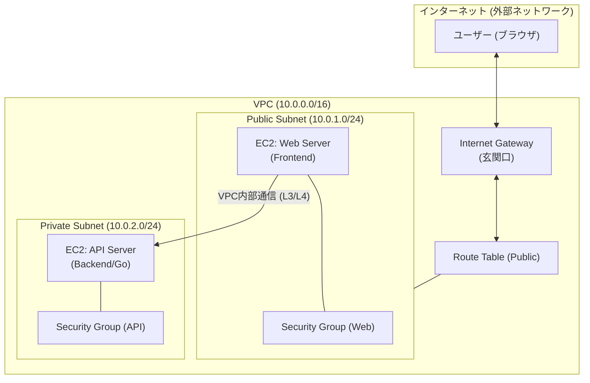

# やったこと

# 最初の状態

# 何につまづいたのか・分からなかったのか

# なぜ詰まったのか

# どう理解に持っていったのか

# 今ならどう説明するか

```mermaid
graph TD
    subgraph Internet["インターネット (外部ネットワーク)"]
        User["ユーザー (ブラウザ)"]
    end

    User <--> IGW["Internet Gateway<br/>(玄関口)"]

    subgraph VPC["VPC (10.0.0.0/16)"]
        IGW <--> PublicRT["Route Table (Public)"]

        subgraph PublicSubnet["Public Subnet (10.0.1.0/24)"]
            direction TB
            WebSG["Security Group (Web)"]
            WebServer["EC2: Web Server<br/>(Frontend)"]
            WebServer --- WebSG
        end

        subgraph PrivateSubnet["Private Subnet (10.0.2.0/24)"]
            direction TB
            APISG["Security Group (API)"]
            APIServer["EC2: API Server<br/>(Backend/Go)"]
            APIServer --- APISG
        end

        PublicRT --- PublicSubnet
        WebServer -- "VPC内部通信 (L3/L4)" --> APIServer
    end
```