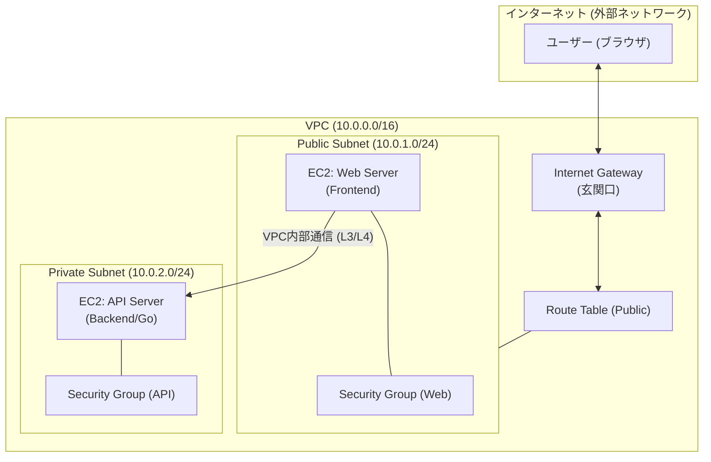

# やったこと
- セキュリティグループ
- ACLの概念について
- ポート番号について

# 最初の状態
セキュリティグループとACLの違いが分からなかった。

# 何につまづいたのか・分からなかったのか
セキュリティグループはEC2インスタンスに与える、WAFのような役割だが、ACLはなんだ？
他の人のAWSアーキテクチャ図を見る限り、ACLを必須で使っているというわけではなかった。
このACLって使えるなら使ったほうがいいのか、それとも使わなくてもいいのか判断要素が自分の中になく混乱した。

# なぜ詰まったのか
ネットワークの理解不足。サブネットについて

# どう理解に持っていったのか
ACLが、まずサブネットに対してのセキュリティだと知った。
具体的には、
- INルール： 外 → サブネット (検査する)
- OUTルール： サブネット → (検査する)
両方の検査をしているが、デフォルトNACLは全部許可している。
このサブネット内に入れても良いかを検査する役割を担っていることを知った。

# 今ならどう説明するか
まだ理解が不十分なので、期末テスト終えたら、またここから勉強し直す。
セキュリティグループとACLの噛み合わせがわからない。実際にAWSを操作して検証してみる必要がある。

